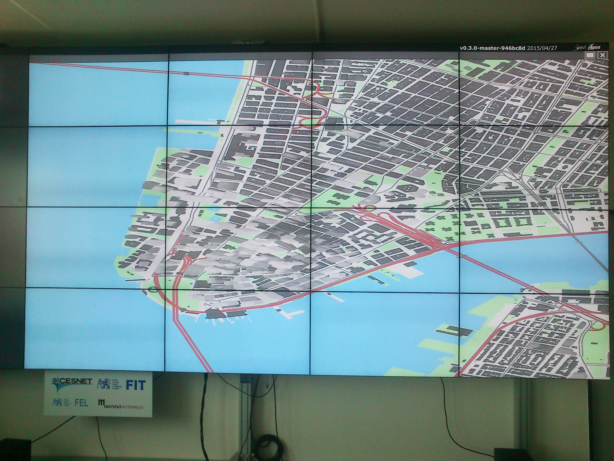

# 3D OpenStreetMap for SAGE2 wall

We are using [Mapzen Tangram](http://mapzen.com/tangram) rendering library and https modification of [simple-demo](https://github.com/tangrams/simple-demo).

See [specification PDF](docs/specifikace.pdf) (in czech)

## Instalation

Just copy this directory to `SAGE2/public_HTTPS/uploads/apps/` and relaunch SAGE2.

## Author and license

(c) [Pavel Zbytovský](http://zby.cz) 2015

Released under MIT license.
